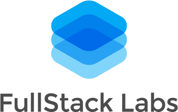

# Before You Start

Please follow the [`Getting Started` section on README](./README.md) to set up
your environment before starting the challenge.

# Summary
For this code challenge a Candidate will clone and setup an existing Rails
application.  The application will contain routes, migrations, models, and
minimal views but with no actual functionality created. The candidate will show
all her/his expertise building apps with the Ruby on Rails framework and problem
solving skills.

# Overview
HeyURL! is a service to create awesome friendly URLs to make it easier for
people to remember. Our team developed some mock views but they lack our awesome
functionality.

# Requirements
1. Implement actions to create a short URL based on a given full URL
1. If URL is not valid, the application returns an error message to the user
1. We want to be able to provide basic click metrics to our users for each URL they generate.
   1. Every time that someone clicks a short URL, it should record that click
   1. the record should include the user platform and browser detected from the user agent
1. We want to create a metrics panel for the user to view the stats for every short URL.
   1. The user should be able to see total clicks per day on the current month
   1. An additional chart with a breakdown of browsers and platforms
1. If someone tries to visit a invalid short URL then it should return a 404 page
1. Controllers, endpoints and models should be fully tested with RSpec

# Spec for generating short URLs
- It MUST have 5 characters in length e.g. NELNT
- It MUST generate only upper case letters
- It MUST NOT generate special characters
- It MUST NOT generate whitespace
- It MUST be unique
- `short_url` attribute should store only the generated code

# Recommendations

1. Check routes defined in [`config/routes.rb`](./config/routes.rb)
1. Check controller actions in [`app/controllers/urls_controller.rb`](./app/controllers/urls_controller.rb)
1. Check views in [`app/views/urls/`](./app/views/urls)
1. Check existing tests in the [`spec` folder](./spec)
1. Google Charts is already added to display charts but you can use any library
1. Use the [`browser` gem](https://github.com/fnando/browser) already installed
   to extract information about each click tracked

# Pages
The following pages/urls are already built into our app:

1. `GET /`: Contains the form and a list of the last 10 URL created with their
   click count
1. `GET /:url`: Redirects from a short URL to the original URL and should also
   track the click event
1. `GET /urls/:url`: Shows the metrics associated to the short URL

# API - Optional Bonus Points
We would like to have a way to retrieve the last 10 URLs created using an API
endpoint. It should be JSON-API complaint. Here is an example of a response from
the API:

```
{
  "data": [
    {
      "type": "urls",
      "id": "1",
      "attributes": {
        "created-at": "2018-08-15T02:48:08.642Z",
        "original-url": "www.fullstacklabs.co/angular-developers",
        "url": "https://domain/fss1",
        "clicks": 2
      },
      "relationships": {
        "clicks": {
          "data": [
            {
              "id": 1,
              "type": "clicks"
            }
          ]
        }
      }
    }
  ],
  "included": [
    {
      "type": "clicks",
      "id": 1,
      "attributes": {
        ...
      }
    }
  ]
}
```

# Accomplishment
- Completed functionality 65%
- Completed test 20%
- Completed bonus 15%
